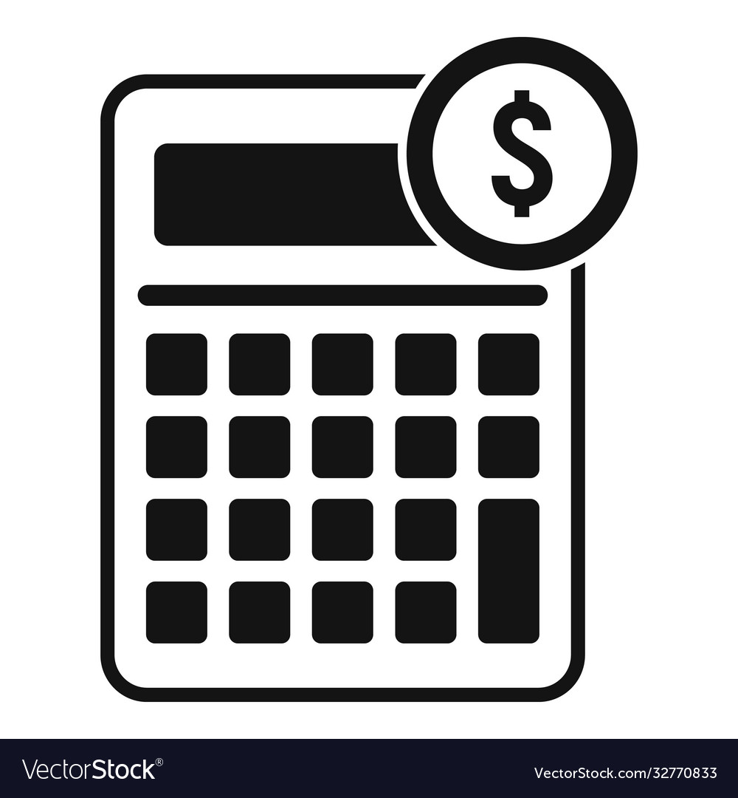

# JavaScript Projects Showcase 🌐

</img>

Welcome to the JavaScript Projects Showcase! Explore a variety of simple yet effective JavaScript projects that cover different aspects of web development. Each project is designed to enhance your JavaScript skills and provide practical examples for real-world scenarios.

## Project List 🚀

### 1. Love Calculator 💖


- **Description:** Calculate the love compatibility between two individuals by entering their names. The algorithm generates a random love score and provides a fun and entertaining result.

- **Usage:**
  - Open the `love_calculator.html` file in your browser.
  - Enter the names of two individuals and click the "Calculate Love" button.
  - Witness the magic of love in percentage!

### 2. Body Mass Index (BMI) Calculator 🏋️‍♂️


- **Description:** Determine the Body Mass Index (BMI) by entering the weight and height of an individual. The BMI calculator provides a classification based on standard BMI ranges.

- **Usage:**
  - Open the `bmi_calculator.html` file in your browser.
  - Enter the weight (in kilograms) and height (in meters) and click the "Calculate BMI" button.
  - Receive the BMI value along with the corresponding classification.
 
### 3. Loan Calculator 💸


- **Description:** Empower users to make informed financial decisions by calculating loan details, including interest rates and monthly payments.

- **Usage:**
  - Open the `loan_calculator.html` file in your browser.
  - Enter the loan amount, interest rate, and loan duration.
  - View the calculated monthly payment and total repayment.

### 4. Counter Application 🔢


- **Description:** Build a simple counter application that increments, decrements, and resets a counter. Ideal for understanding event handling.

- **Usage:**
  - Open the `counter_app.html` file in your browser.
  - Click the "Increment" and "Decrement" buttons to modify the counter value.
  - Simple yet effective for counting!

### 5. Palindrome Checker 🔄


- **Description:** Determine whether a given word or phrase is a palindrome. Strengthen your string manipulation skills in JavaScript.

- **Usage:**
  - Open the `palindrome_checker.html` file in your browser.
  - Enter a word or phrase.
  - Discover whether it's a palindrome or not.


### 6. RGB Color Generator 🌈


- **Description:** Create a tool that generates random RGB colors. Experiment with color combinations and improve your DOM manipulation skills.

- **Usage:**
  - Open the `rgb_color_generator.html` file in your browser.
  - Click the "Generate" button to get a random RGB color.
  - Copy the generated color code for your projects.

### 7. Tip Calculator 💸


- **Description:** Easily calculate tips for a bill amount with the Tip Calculator. Customize the tip percentage and see the total amount payable, including the tip.

- **Usage:**
  - Open the `tip_calculator.html` file in your browser.
  - Enter the bill amount and select the tip percentage using the slider.
  - Instantly view the tip amount and the total bill.

### 8. Time and Date Widget ⌚


- **Description:** Display real-time clock and date information. Learn how to manipulate the Date object and update the UI dynamically.

- **Usage:**
  - Open the `time_date_widget.html` file in your browser.
  - Get real-time information on the current date and time.
  - A handy utility for your web projects.


### 9. Get Unicode Character Value 🌐


- **Description:** Develop a tool that provides the Unicode value of a given character. Enhance your knowledge of character encoding in JavaScript.

- **Usage:**
  - Open the `unicode_character.html` file in your browser.
  - Enter a character, and the corresponding Unicode value will be displayed.

### 10. Age Calculator Application 🎂


- **Description:** Calculate the age based on the birthdate provided. Understand date manipulations and improve your user interface skills.

- **Usage:**
  - Open the `age_calculator.html` file in your browser.
  - Input your birthdate, and the application will calculate your age.

## Getting Started 🚀
1. Clone the repository:
   ```bash
   git clone https://github.com/kunalarya873/JavaScript-Projects.git
   ```
2. Navigate to the project you want to explore.
3. Open the respective HTML file in your browser.

## Project Structure 📁
- `images/`: Contains project images.
- `love_calculator.html`: Love Calculator project.
- `bmi_calculator.html`: BMI Calculator project.
- `tip_calculator.html`: Tip Calculator project.

## 💡 Contribute and Collaborate

We believe in the power of community-driven learning. Contribute your knowledge, insights, or code implementations to help others learn and grow.

# How to Contribute

Contributions are welcome! If you have additional cheatsheets, improvements, or corrections, feel free to contribute. Follow these steps:

1. Fork the repository.
2. Create a new branch: `git checkout -b feature/your-feature`.
3. Commit your changes: `git commit -m 'Add your feature'`.
4. Push to the branch: `git push origin feature/your-feature`.
5. Open a pull request.

<!-- Getting Started Section -->
## Getting Started

To get started with this project, follow these steps:

1. **Clone the Repository**:
   ```bash
   git clone https://github.com/kunalarya873/JavaScript-Projects

## 🌈 Start Your Journey

Ready to enhance your JS skills? Dive into our comprehensive resources and embark on a learning journey that will transform you into a JavaScript wizard! 🧙‍♂️

[](https://github.com/kunalarya873)

---

[**Get Started**](https://github.com/kunalarya873/JavaScript-Projects) • [**Contributors**](https://github.com/kunalarya873) • [**Resources**](https://github.com/kunalarya873/Python_DSA/blob/main/Data%2BStructures%2Band%2BAlgorithms%2BBootcamp%2Bin%2BPython%2Bslides%2BRemaster.pdf) • [**Join the Discussion**](#)
